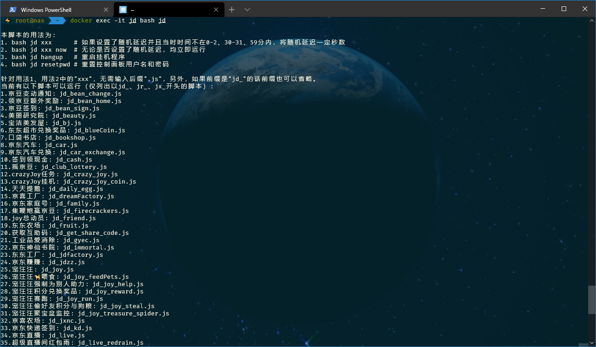
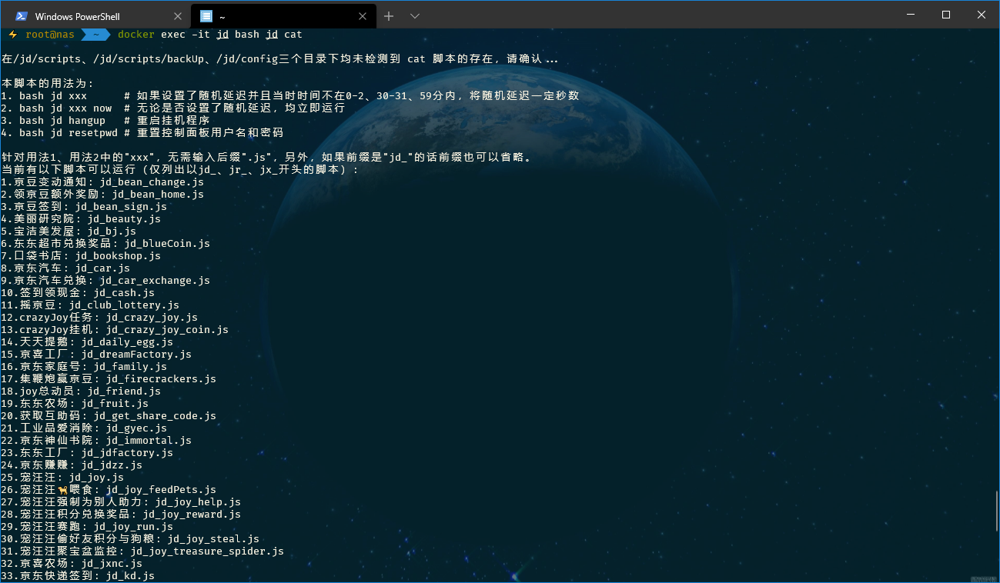

## 脚本可以干什么

1. 自动更新lxk0301的京东薅羊毛脚本，自动更新我的shell脚本。

2. 自动按设定天数删除旧日志。

3. 自动添加新的定时任务。

4. 自动删除失效的定时任务。

5. 自动按crontab.list设定的时间去跑各个薅羊毛脚本。

## 操作流程

1. 下载两个文件，假如下载到`/appdata/jd`下，可以如下操作：

    ```shell
    cd /appdata/jd

    # 必须创建config文件夹，用来保存下面要下载的两个配置文件
    mkdir config

    # 下载本仓库的sample/config.sh.sample，保存到刚刚创建的config文件夹下，并命名为 config.sh（必须是这个名称）
    wget --no-check-certificate https://gitee.com/evine/jd-base/raw/v3/sample/config.sh.sample -O config/config.sh

    # 下载本仓库的sample/docker.list.sample，保存到刚刚创建的config文件夹下，并命名为 crontab.list（必须是这个名称）
    wget --no-check-certificate https://gitee.com/evine/jd-base/raw/v3/sample/docker.list.sample -O config/crontab.list
    ```

2. 分别编辑刚刚下载到config文件夹下的两个文件，建议Windows用户使用WinSCP工具连接服务器进行编辑。

    其中`config.sh`是配置文件，`crontab.list`是定时任务清单。
    
    关于`crontab.list`，说明一下，除了那些本来就会准时运行的脚本外，如果还有一些脚本你不想随机延迟，要么在`config.sh`中`RandomDelay`不要赋值(所有任务都将不延迟执行)，要么参考下面 [如何手动运行脚本](Docker#如何手动运行脚本) 部分，在`crontab.list`中不想被随机延迟运行的任务后面，添加上 `now`，比如`20 * * * * bash jd jd_dreamFactory now`

    - *注1：如果在windows下编辑，请使用WinSCP自带编辑器，或 notepad++、VS Code、Sublime Text 3等软件，请不要使用记事本。*

    - *注2：如何修改请仔细阅读文件中的注释部分。*

    - *注3：如果在WinSCP中看不见文件或看见了但不是最新的文件，请点击鼠标右键-刷新来刷新文件清单。*

3. 安装好docker([中文教程](https://mirrors.bfsu.edu.cn/help/docker-ce/))，然后创建容器：

    - 如果你想从github更新脚本：

    ```shell
    docker run -dit \
    -v /appdata/jd/config:/jd/config `# 冒号左边是刚刚下载的两个文件存放的目录` \
    -v /appdata/jd/log:/jd/log `# 日志保存目录` \
    --name jd \
    --hostname jd \
    --restart always \
    --network host `#如果是旁路由OpenWrt的Docker，建议添加上此行` \
    evinedeng/jd
    ```

    - 如果你想从gitee更新脚本：
    
    ```shell
    docker run -dit \
    -v /appdata/jd/config:/jd/config `# 冒号左边是刚刚下载的两个文件存放的目录` \
    -v /appdata/jd/log:/jd/log `# 日志保存目录` \
    --name jd \
    --hostname jd \
    --restart always \
    --network host `#如果是旁路由OpenWrt的Docker，建议添加上此行` \
    evinedeng/jd:gitee
    ```

    - 如果想同时运行多个容器并发，建议使用docker-compose安装(仅支持x86机器)，不过如果docker-compose不支持你平台，或者你不想用docker-compose，按上述方式部署**不同名称不同映射路径**的容器也是可以的，看你个人需要。

        如需使用docker-compose，请前往 [这里](https://github.com/docker/compose/releases/) 下载最新版本的文件，放在本机 `/usr/local/bin`下，并重命名为`docker-compose`。

        然后参考本仓库的 [docker-compose.yml](https://github.com/EvineDeng/jd-base/blob/v3/docker/docker-compose.yml) 准备好你自己的`docker-compose.yml`，然后部署：

        ```shell
        ## cd 到docker-compose.yml的存放路径下
        docker-compose up -d
        ```

4. 部署完成。

5. 如何自动更新Docker容器

    安装`containrrr/watchtower`可以自动更新容器，它也是一个容器，但这个容器可以监视你安装的所有容器的原始镜像的更新情况，如有更新，它将使用你原来的配置自动重新部署容器。部署`containrrr/watchtower`最简单的方式如下：

    ```shell
    docker run -d \
        --name watchtower \
        -v /var/run/docker.sock:/var/run/docker.sock \
        containrrr/watchtower
    ```

    你也可以访问 https://containrrr.dev/watchtower/ 获取更详细的部署说明，包括如何避开某些容器不让它自动更新，如何发更新容器后发送通知，设置检测时间等等。

## 如何更新配置文件

`config.sh`和`crontab.list`两个文件都一样，改完保存好就行，其他啥也不用干，容器也不用重启什么，改完以后，新的任务就以新配置运行了。

## 如何添加除lxk0301大佬以外的脚本

### 如果你其他的脚本不使用环境变量

本环境基于node，所以也只能跑js脚本，使用`docker cp`命令将脚本复制到容器中的`/jd/scripts/`目录下：

```shell
docker cp /你宿主机上的其他额外的脚本路径/test.js jd:/jd/scripts/
```

然后在你的配置目录`config`下`crontab.list`中添加如下的定时任务（只是举例）：

```shell
15 10 * * * node /jd/scripts/test.js | ts "%Y-%m-%d %H:%M:%S" >> /jd/log/test.log 2>&1
```

**注意：每次更新镜像或重新部署以后要重新运行一下`docker cp`命令，但`crontab.list`不用再改了。**

### 如果你其他的脚本用的环境变量

- 有两个办法，分别如下：

1. 直接在创建容器时给容器增加环境变量的命令`-e 变量名="变量值" \`，或者添加到docker-compose.yml中增加`environment:`以docker-compose启动。

    **此办法时，要更新环境变量，必须停止容器-删除容器-修改变量-重新部署容器。**
    
    此方式下定时任务直接按上面`不使用环境变量`那种添加方式添加即可。

2. 在`config`配置目录下新建一个配置文件`config2.sh`，以以下形式写入变量：

    ```shell
    export 变量名1="变量值1"
    export 变量名2="变量值2"
    export 变量名3="变量值3"
    # 以此类推
    ```

    这种形式要按如下方式添加定时任务(注意cron后有个半角的点)：

    ```shell
    15 14 * * * . /jd/config/config2.sh && node /jd/scripts/test.js | ts "%Y-%m-%d %H:%M:%S" >> /jd/log/test.log 2>&1
    ```

    **使用这种方式时，无需重启容器，任何时候直接修改好`config2.sh`立即生效。**

- 然后按`不使用环境变量`中的`docker cp`命令把脚本复制到容器中。

    **注意：每次更新镜像或重新部署以后要重新运行一下`docker cp`命令，但`crontab.list`不用再改了。**

## 如何手动运行脚本

1. 手动 git pull 更新脚本

    ```shell
    docker exec -it bash git_pull
    ```

2. 手动删除指定时间以前的旧日志

    ```shell
    docker exec -it bash rm_log
    ```

3. 手动执行薅羊毛脚本，用法如下(其中`exec`后面的`jd`为容器名，`bash`后面的`jd`为命令名，`xxx`为lxk0301大佬的脚本名称)，不支持直接以`node xxx.js`命令运行：

    ```
    docker exec jd bash jd xxx      # 如果设置了随机延迟并且当时时间不在0-2、30-31、59分内，将随机延迟一定秒数
    docker exec jd bash jd xxx now  # 无论是否设置了随机延迟，均立即运行
    ```

    如果你忘记了命令也不要紧，只要你记得命令`jd`就行，输入后会提示你：

    

    脚本名不记得也不要紧，输错了也会提示你的：

    