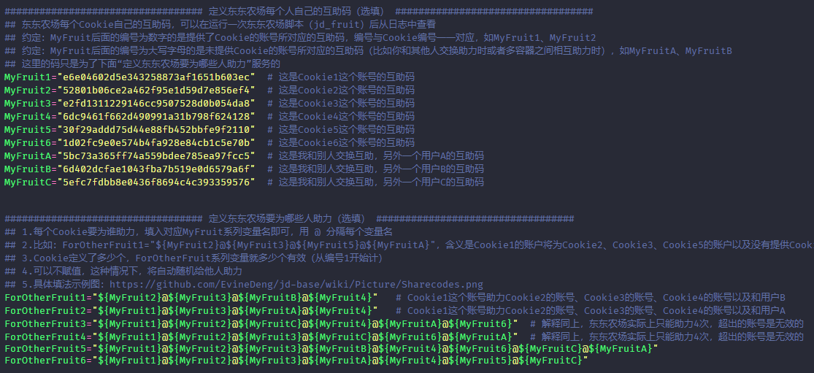

## 配置文件

### 互助码填法

    互助码是填在My系列变量中的，ForOther系统变量中只要填入My系列的变量名即可，按注释中的例子拼接，如下图所示：



### 如何控制不同时间赋不同的值

```shell
## 时间
$(date "+%d") # 当前的日期，如：13
$(date "+%w") # 当前是星期几，如：3
$(date "+%H") # 当前的小时数，如：23
$(date "+%M") # 当前的分钟数，如：49

## 两个数字比较
-eq  # 前后两个数字相等
-ne  # 前后两个数字不等
-lt  # 前面数字小于后面数字
-le  # 前面数字小于或等于后面数字
-gt  # 前面数字大于后面数字
-ge  # 前面数字大于或等于后面数字
```

在config.sh.sample中其实已经给出过一个例子了，就是控制`东东萌宠是否静默运行`这个变量`PET_NOTIFY_CONTROL`，示例如下：

```shell
if [ $(date "+%w") -eq 6 ] && [ $(date "+%H") -ge 9 ] && [ $(date "+%H") -lt 14 ]; then    # 如果当前是周六，当前小时数大于等于9并且小于14，则让东东萌宠发通知
  export PET_NOTIFY_CONTROL="false"
elif [ $(date "+%w") -eq 3 ] && [ $(date "+%H") -ge 9 ] && [ $(date "+%H") -lt 14 ]; then  # 如果当前是周三，当前小时数大于等于9并且小于14，则让东东萌宠发通知
  export PET_NOTIFY_CONTROL="false"
else
  export PET_NOTIFY_CONTROL="true"    # 其他非上述时间段时，通通不发通知
fi
```

在这里再额外给一些不同时间赋不同的具体例子：

1. 比如点点券（jd_necklace）的cron为`20 0,20 * * *`，每天0:20和20:20各运行一次，运行一次会发通知，但又不想收到通知，则可以在这两个时间点取消通知TOKEN的赋值（以钉钉为例）：


```shell
if [ $(date "+%H") -eq 0 ] && [ $(date "+%M") -eq 20 ]; then      # 点点券
  export DD_BOT_TOKEN=""
  export DD_BOT_SECRET=""
elif [ $(date "+%H") -eq 20 ] && [ $(date "+%M") -eq 20 ]; then   # 点点券
  export DD_BOT_TOKEN=""
  export DD_BOT_SECRET=""
else
  export DD_BOT_TOKEN="f8af60daa6a8ac99XXXXXXXXXXXXXXXXXXXXa07dbe10b4dbe324377bc"
  export DD_BOT_SECRET="SEC08db895aXXXXXXXXXX3acaeab76736e16cXXXXXXXXXX3412a4f36942aa905f76"
fi
```

2. 又比如想在报名宠汪汪赛跑时，调整Cookie顺序，让后面的账号先报名，前面的账号后报名，假如报名这一次的cron时间为10:02，则可以：

```shell
if [ $(date "+%H") -eq 10 ] && [ $(date "+%M") -eq 2 ]
then  # 每天10：02报名宠汪汪赛跑时调整顺序
  Cookie8="pt_key=AAAAAAAAAAAAAAAAAAAAAAAAAAAAAAAAAAAAAAAAAAAAAAAAAAAAAAAAAAAAAAAAAAAAAAAAAAA;pt_pin=XXXXXXXX;"
  Cookie7="pt_key=BBBBBBBBBBBBBBBBBBBBBBBBBBBBBBBBBBBBBBBBBBBBBBBBBBBBBBBBBBBBBBBBBBBBBBBBBBB;pt_pin=XXXXXXXX;"
  Cookie5="pt_key=CCCCCCCCCCCCCCCCCCCCCCCCCCCCCCCCCCCCCCCCCCCCCCCCCCCCCCCCCCCCCCCCCCCCCCCCCCC;pt_pin=XXXXXXXX;"
  Cookie6="pt_key=DDDDDDDDDDDDDDDDDDDDDDDDDDDDDDDDDDDDDDDDDDDDDDDDDDDDDDDDDDDDDDDDDDDDDDDDDDD;pt_pin=XXXXXXXX;"
  Cookie1="pt_key=EEEEEEEEEEEEEEEEEEEEEEEEEEEEEEEEEEEEEEEEEEEEEEEEEEEEEEEEEEEEEEEEEEEEEEEEEEE;pt_pin=XXXXXXXX;"
  Cookie2="pt_key=FFFFFFFFFFFFFFFFFFFFFFFFFFFFFFFFFFFFFFFFFFFFFFFFFFFFFFFFFFFFFFFFFFFFFFFFFFF;pt_pin=XXXXXXXX;"
  Cookie3="pt_key=GGGGGGGGGGGGGGGGGGGGGGGGGGGGGGGGGGGGGGGGGGGGGGGGGGGGGGGGGGGGGGGGGGGGGGGGGGG;pt_pin=XXXXXXXX;"
  Cookie4="pt_key=HHHHHHHHHHHHHHHHHHHHHHHHHHHHHHHHHHHHHHHHHHHHHHHHHHHHHHHHHHHHHHHHHHHHHHHHHHH;pt_pin=XXXXXXXX;"
else
  Cookie1="pt_key=AAAAAAAAAAAAAAAAAAAAAAAAAAAAAAAAAAAAAAAAAAAAAAAAAAAAAAAAAAAAAAAAAAAAAAAAAAA;pt_pin=XXXXXXXX;"
  Cookie2="pt_key=BBBBBBBBBBBBBBBBBBBBBBBBBBBBBBBBBBBBBBBBBBBBBBBBBBBBBBBBBBBBBBBBBBBBBBBBBBB;pt_pin=XXXXXXXX;"
  Cookie3="pt_key=CCCCCCCCCCCCCCCCCCCCCCCCCCCCCCCCCCCCCCCCCCCCCCCCCCCCCCCCCCCCCCCCCCCCCCCCCCC;pt_pin=XXXXXXXX;"
  Cookie4="pt_key=DDDDDDDDDDDDDDDDDDDDDDDDDDDDDDDDDDDDDDDDDDDDDDDDDDDDDDDDDDDDDDDDDDDDDDDDDDD;pt_pin=XXXXXXXX;"
  Cookie5="pt_key=EEEEEEEEEEEEEEEEEEEEEEEEEEEEEEEEEEEEEEEEEEEEEEEEEEEEEEEEEEEEEEEEEEEEEEEEEEE;pt_pin=XXXXXXXX;"
  Cookie6="pt_key=FFFFFFFFFFFFFFFFFFFFFFFFFFFFFFFFFFFFFFFFFFFFFFFFFFFFFFFFFFFFFFFFFFFFFFFFFFF;pt_pin=XXXXXXXX;"
  Cookie7="pt_key=GGGGGGGGGGGGGGGGGGGGGGGGGGGGGGGGGGGGGGGGGGGGGGGGGGGGGGGGGGGGGGGGGGGGGGGGGGG;pt_pin=XXXXXXXX;"
  Cookie8="pt_key=HHHHHHHHHHHHHHHHHHHHHHHHHHHHHHHHHHHHHHHHHHHHHHHHHHHHHHHHHHHHHHHHHHHHHHHHHHH;pt_pin=XXXXXXXX;"
fi
```
    
## 容器时间

据反馈，arm/v7平台上的Docker容器，时间有问题，怎么改都只能是UTC时间。在这种情况下，直接用你的arm/v7机器，按照我的Dockerfile自行构建一个镜像，那么时间就可以是北京时间。构建流程：

1. cd 至你的一个文件夹下，然后克隆仓库：

    ```shell
    git clone https://github.com/EvineDeng/jd-base
    ```

2. 进入刚刚克隆的文件夹内：

     ```shell
     cd jd-base
     ```

3. 构建镜像，注意最后有个点，构建好的镜像名称为`jd-base`：

    ```shell
    docker build -t jd-base:latest -f Docker/Dockerfile .
    ```

4. 按照你之前创建容器的命令，或者参考 [[Docker]] 教程中的命令，创建容器即可，不过要将原来我的镜像 `evinedeng/jd-base:latest` 切换为你自己刚刚构建的镜像 `jd-base:latest` 。

5. 我如果在 [release](https://github.com/EvineDeng/jd-base/releases) 页面发布了新的 release，那么就意味着你也可以重新构建你的容器了。记得先删除原来的容器和原来的镜像。

## 日志报错

- 日志报以下错误：
    ```
    TypeError: (intermediate value)(...).catch(...).finally is not a function
    at Object. (/home/bobotoy/jd/scripts/jd_bean_sign.js:52:13)
    at Module._compile (module.js:652:30)
    at Object.Module._extensions..js (module.js:663:10)
    at Module.load (module.js:565:32)
    at tryModuleLoad (module.js:505:12)
    at Function.Module._load (module.js:497:3)
    at Function.Module.runMain (module.js:693:10)
    at startup (bootstrap_node.js:188:16)
    at bootstrap_node.js:609:3
    ```
    首先，需要保证Node.js大版本>=10，其次，在>=10的某些小版本也有此问题（你可以使用`node -v`或`nodejs -v`查看Node.js的版本），问题及详细的解决措施见[nodejs/help#1877](https://github.com/nodejs/help/issues/1877)。
